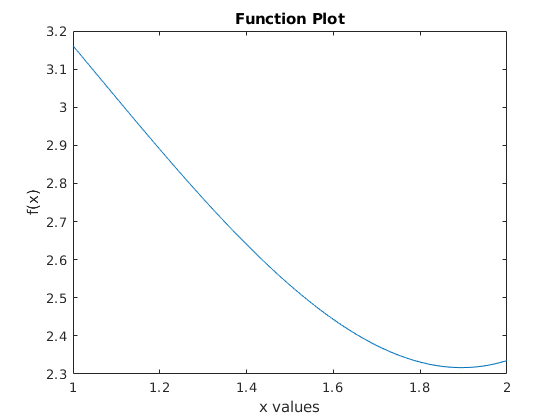

# Line Search Algorithms for Local Minimizers
This project demonstrates how line search algorithms can find the local minimizer of a function. Line search algorihms implemented in this repository are Newton's method, secant method, bisection search method, golden section search method.
# Code Implementation
Codes are implemented in Matlab R2018b and C++11.
# Description
This codes show that local minimizers of following function.
```
    f(x) = x^2 + 4cos(x)
```
Codes search local minimizer of this function at [1,2] interval. However, any function can be implemented. Four methods are coded. There are four script for every different methods. All methods are sensitive to initial points. Appropriate initial points should be selected for other functions. 
# Execution
Initial point is given following.
```
    x = 1
```
To run these codes, simple write at command line in the Matlab
```
    run anysearchalgorithm.m         
```
The output will looks like this
``` 
        Newton's Method
    Iteration : 13
    Computation Time : 191
    Minimum point of function : x = 1.89549, f(x) = 2.31681
```
On the other hand, the secant method finds that  minimum point is -1.895494 because of that it takes only one initial point which is 1. Function wanted to be minimized is even so that -1.895494 is also minimum point of function.   
# Conclusion
The function is unimodal means just one local minimum point of function at this interval. If function is not unimodal, search algorithms could be stuck any local minimizer of function. The plot of the function in the given codes:
